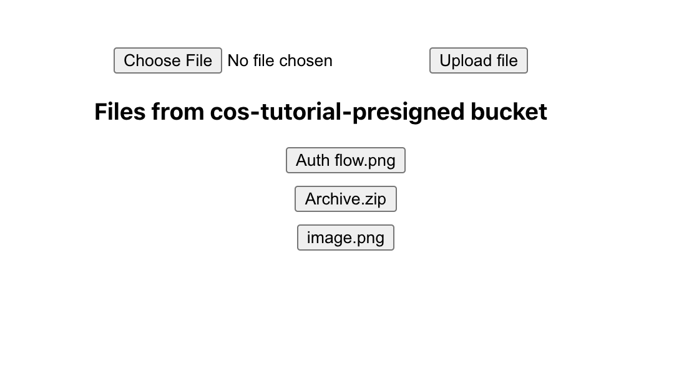

# Multipart file upload directly from the browser using the S3 API in IBM Cloud Object Storage. A Node.js and React tutorial.

Usually, applications that handle file upload will send the files from a client through a server before actually uploading them to a storage service. 
The problem with this approach is that you may end up with a bottleneck that causes performance issues when you have multiple clients uploading large files at the same time.
One way of removing this bottleneck is if the client side could upload directly to the storage service without sending the file through the server and, in addition, if you have to upload a large file, you can split it up into parts to upload them in parallel, boosting up the upload performance.
To achieve this you can use [IBM Cloud Object Storage(COS)](https://cloud.ibm.com/docs/cloud-object-storage) service. It uses a subset of the [S3 API](https://cloud.ibm.com/docs/cloud-object-storage/api-reference?topic=cloud-object-storage-compatibility-api), which includes the [**presigned URL**](https://cloud.ibm.com/docs/cloud-object-storage?topic=cloud-object-storage-presign-url) and [**multipart upload**](https://cloud.ibm.com/docs/cloud-object-storage?topic=cloud-object-storage-large-objects) features. A presigned URL is a temporary link generated from your COS credentials that you can send to clients so they can do operations to specific objects without authentication, because your server has the credentials and used it to sign the URL. The client can use the URL retrieved from the server to upload/download files directly to/from a *bucket* at your COS instance.

The following image shows two simple architecture drawings, the one in the left is what is usually done and the one in the right is what we are going to build:


In this tutorial you will: 
- Setup a COS instance to store your files. 
- Build a [**Node.js API**](https://cloud.ibm.com/docs/cloud-object-storage?topic=cloud-object-storage-node) to retrieve presigned URLs from the COS instance using your credentials.
- Build a simple React front-end app to consume the API, split a file into parts if needed, and upload them to COS using the presigned URLs.

# Prerequisites

- [Node.js and npm](https://nodejs.org/en/) installations. I'm using node 14.15.3 version and npm 6.14.9 version.
- An [IBM Cloud account](https://cloud.ibm.com/registration).
- A text editor. I'm using [VSCode](https://code.visualstudio.com/).

You can find the entire code created for the tutorial in this repo [https://github.com/gustavares/cos-tutorial/](https://github.com/gustavares/cos-tutorial/).
  
# Estimated time

TBD

# Steps

<!-- no toc -->
- [1. COS instance creation](#1-cos-instance-creation)
  - [1.1 Creating HMAC Credential](#11-creating-hmac-credential)
- [2. Node setup](#2-node-setup)
  - [2.1 COS environment variables](#21-cos-environment-variables)
    - [2.1.1 Getting the **COS_ENDPOINT** variable value](#211-getting-the-cos_endpoint-variable-value)
  - [2.2 Enabling CORS requests and exposing the ETag header](#22-enabling-cors-requests-to-our-bucket)
    - [2.2.1 Configuring the COS connection object](#221-configuring-the-cos-connection-object)
    - [2.2.2 Creating the script](#222-creating-the-script)
- [3. Express API setup](#3-express-api-setup)
  - [3.1 COS functions](#31-cos-functions)
    - [3.1.1 listFilesFromBucket function](#311-listfilesfrombucket-function)
    - [3.1.2 getPresignedUrl function](#312-getpresignedurl-function)
  - [3.2 Routes](#32-routes)
    - [3.2.1 List files route](#321-list-files-route)
    - [3.2.2 Download and Upload routes](#322-download-and-upload-routes)
- [4. Front-end React application](#4-front-end-react-application)
  - [4.1 .env file](#41-env-file)
  - [4.2 api.js](#42-apijs)
  - [4.3 fileButton.js](#43-filebuttonjs)
  - [4.4 fileList.js](#44-filelistjs)
  - [4.4 uploadInput.js](#44-uploadinputjs)
  - [4.5 App.js](#45-appjs)
- [References](#references)
        

## 1. **COS instance creation**

Once logged into your IBM Cloud account, type *"Object Storage"* in the search bar at the top and select the Object Storage item or follow this link: [https://cloud.ibm.com/objectstorage/create](https://cloud.ibm.com/objectstorage/create). 

While at the creation screen, leave the "Lite" plan selected, scroll down to give your instance a name, and then click on the "Create" button on the right.


When inside your COS instance, click on the "Buckets" item in the left, then in the "Create bucket +" button to the right.


Now, on the create bucket screen select the "Quickly get started" option clicking in the arrow pointing right.


Leave the "Create bucket with credentials" option selected, give your bucket a name and click "Next" two times, scroll all the way down and click on the "View bucket configuration" button.


### 1.1 Creating HMAC Credential

To be able to use presigned URLs we need an [HMAC credential](https://cloud.ibm.com/docs/cloud-object-storage?topic=cloud-object-storage-uhc-hmac-credentials-main).

Click on the "Service credentials" item to the left, then on the "New credential +" button to the right.


Then on the "Create credential" modal, name your credential, click on the "Advance options" button, turn on the "Include HMAC Credential" option, and then click on the "Add" button.


Later we are coming back here to copy the contents of the created credential and paste it in our `.env` file.

## 2. **Node setup**

Create a folder for your server and then create a package.json using `npm init`. I'm using the `esm --yes` option so we can use `import/export` syntax:

```
$ mkdir server && cd server
$ npm init esm --yes
```
After running these commands you should have the following files inside your `server` folder:

```
server
|
└── index.js
└── main.js
└── package.json
└── package-lock.json
```

Then create the three extra files that we are going to need later: `routes.js`, `cos.js`, and `.env`:

```
server
|
└── index.js  // requires ESM modules and calls 'main.js'
└── main.js   // app start and express config
└── package.json
└── package-lock.json
└── routes.js // has our API routes, handling express middlewares
└── cos.js    // handles everything related to COS
└── .env      // holds our environment variables
```
### 2.1 **COS environment variables**

Open the `.env` file and create the following variables and copy the correspondent values from the HMAC credential created earlier.

```
COS_ENDPOINT=<endpoint> // check the next section to get this value
COS_APIKEYID=<api-key>
COS_IBM_AUTH_ENDPOINT=https://iam.cloud.ibm.com/identity/token
COS_RESOURCE_INSTANCE_ID=<resource-instance-id>
COS_HMAC_ACCESS_KEY_ID=<access_key_id>
COS_HMAC_SECRET_ACCESS_KEY=<secret_access_key>
```

You can find these values in your COS instance on IBM Cloud, clicking on the "Service credentials" item on the left.


*NOTE: This might be obvious but never expose your credentials! Don't forget to add the .env file to .gitignore.*

#### 2.1.1 **Getting the COS_ENDPOINT variable value**

- Back in your COS instance, click in the **"Buckets"** item on the left, then click in the bucket we created earlier.
- On the left again, click in the **"Configuration"** item and scroll down to find the **"Endpoints"** section.
- Copy the **"Public"** url to your clipboard.
  
- Back in your text editor, in the `.env` file, paste the endpoint value for the `COS_ENDPOINT` variable.

Now we are going to install the dependencies: 

- [Express](https://expressjs.com/) - to create the REST API
- [IBM COS SDK for Node.js](https://www.npmjs.com/package/ibm-cos-sdk) - to easily connect to our COS instance and use its features
- [Dotenv](https://www.npmjs.com/package/dotenv) - to read environment variables from `.env` file
- [Cors](https://www.npmjs.com/package/cors) - to enable CORS requests since the front-end is a separate application
- [Nodemon](https://www.npmjs.com/package/nodemon) - to help in development, automatically restarts the node app when you modify and save a file

From the `server` directory, run the following command:
  
```
$ npm i -S express ibm-cos-sdk dotenv cors && npm i -S -D nodemon
```
Then add the following line to the `scripts` section of your `package.json` file:

```json
"dev": "nodemon index.js"
```

Your `package.json` should look something like this:

```json
{
  "name": "server",
  "version": "1.0.0",
  "description": "",
  "main": "index.js",
  "module": "main.js",
  "scripts": {
    "dev": "nodemon index.js",
  },
  "keywords": [],
  "author": "",
  "license": "ISC",
  "dependencies": {
    "cors": "^2.8.5",
    "dotenv": "^8.2.0",
    "esm": "^3.2.25",
    "express": "^4.17.1",
    "ibm-cos-sdk": "^1.9.0"
  },
  "devDependencies": {
    "nodemon": "^2.0.6"
  }
}
```

### 2.2 **Enabling CORS requests and exposing the ETag header**

In order to use the presigned URL feature, first we need to enable CORS requests to our bucket, and for the multipart upload we need to expose the `ETag` header property. To do this we will write a simple script that will send a CORS configuration object to our bucket using the `ibm-cos-sdk`.

#### 2.2.1 **Configuring the COS connection object**

- Open the `cos.js` file and import `S3` and `Credentials` classes from the `ibm-cos-sdk` and the `dotenv` module.
- Instantiate and export an object called `cos` that receveis an instance of the `S3` class, passing a config object to the constructor like below.
  
Later we will modify this file to hold all the functions to get the presigned URLs and complete the multipart upload, which will be used by our API.
```javascript
// cos.js
import { S3, Credentials } from 'ibm-cos-sdk';
import dotenv from 'dotenv';

dotenv.config();

export const cos = new S3({
    endpoint: process.env.COS_ENDPOINT,
    apiKeyId: process.env.COS_APIKEYID,
    ibmAuthEndpoint: process.env.COS_IBM_AUTH_ENDPOINT,
    serviceInstanceId: process.env.COS_RESOURCE_INSTANCE_ID,
    credentials: new Credentials(
        process.env.COS_HMAC_ACCESS_KEY_ID, 
        process.env.COS_HMAC_SECRET_ACCESS_KEY,
        null
    ),
    signatureVersion: 'v4'
});
```

#### 2.2.2 **Creating the script**

- Create a file called `bucketCorsConfig.js` under the `server` folder.
- Import the `cos` object from the `cos.js` module.
- Create the `enableCorsRequests` async function, copy the implementation from below. This function sends a configuration object that enables `PUT` requests from any origins to the provided bucket. [Here](https://cloud.ibm.com/docs/cloud-object-storage-cli-plugin?topic=cloud-object-storage-cli-plugin-ic-cos-cli#ic-set-bucket-cors) you can read about the `putBucketBucketCors` method we used.
- Lastly, at the end of the file call the created method passing your bucket name, mine is `cos-tutorial-presigned`.
  
```javascript
// bucketCorsConfig.js
import { cos } from './cos';

async function enableCorsRequests(bucketName) {
    try {
        const data = await cos.putBucketCors({
            Bucket: bucketName,
            CORSConfiguration: {
                CORSRules: [
                    {
                        'AllowedMethods': ['PUT'],
                        'AllowedOrigins': ['*'],
                        'AllowedHeaders': ['*'],
                        'ExposeHeaders': ['Etag']
                    }
                ],
            }
        }).promise();
    } catch(e) {
        console.error(`[OBJECT STORAGE] ERROR: ${e.code} - ${e.message}\n`);
        return false;
    }

    console.log(`[OBJECT STORAGE] Configured CORS for ${bucketName}`);
    return true;
}

enableCorsRequests('cos-tutorial-presigned');
```

Now you can open up your terminal and navigate to your `server` directory and run the script with the following command:
```
$ node -r esm bucketCorsConfig.js
```

If everything was alright you will see the following message in the console:
```
[OBJECT STORAGE] Configured CORS for [name of your bucket]
```

## 3. **Express API setup**

Finally, let's start writing our API! In the `main.js` file, we are going to import `express` and `cors` and setup our server to listen on port `3030`. We are also adding a `/health` route just for health check.

```javascript
// ESM syntax is supported.
import express from 'express';
import cors from 'cors';

const PORT = 3030;

const app = express();
app.use(express.json());
app.use(cors());

app.use('/health', (req, res) => res.json('API is up and running!'));

app.listen(PORT, () => {
    console.log(`API listening on port ${PORT}`);
});
```

After saving the file, from the `server` directory run the following command to run the app:

```
$ npm run dev
```

If everything is right, you will see the text *"API listening on port 3030"* on your console, and everytime you save a file you will see that the server restarts.

*NOTE: This is a configuration intended only for the purposes of this tutorial and should not be used in production. Please follow the best practices described in the Express website cited below if you intend to deploy it to a production environment.*

**Express Production Best Practices**

Security - [https://expressjs.com/en/advanced/best-practice-security.html](https://expressjs.com/en/advanced/best-practice-security.html)

Performance and Reliability - [https://expressjs.com/en/advanced/best-practice-performance.html](https://expressjs.com/en/advanced/best-practice-performance.html)
    
### 3.1 **COS functions**

These are the functions responsible to communicate with COS using the `ibm-cos-sdk`. We are going to create the following function in the `cos.js` file: 
- `getPresignedUrl`
- `listFilesFromBucket`
- `initiateMultipartUpload`
- `getPresignedUploadUrlParts`
- `completeMultipartUpload`
- `abortMultipartUpload`
  
Check the implementation below:

```javascript
// cos.js
import { S3, Credentials } from 'ibm-cos-sdk';
import dotenv from 'dotenv';

dotenv.config();

export const cos = new S3({
    endpoint: process.env.COS_ENDPOINT,
    apiKeyId: process.env.COS_APIKEYID,
    ibmAuthEndpoint: process.env.COS_IBM_AUTH_ENDPOINT,
    serviceInstanceId: process.env.COS_RESOURCE_INSTANCE_ID,
    credentials: new Credentials(
        process.env.COS_HMAC_ACCESS_KEY_ID, 
        process.env.COS_HMAC_SECRET_ACCESS_KEY,
        null
    ),
    signatureVersion: 'v4'
});

export async function listFilesFromBucket(bucketName) {
    const result = await cos.listObjects({
        Bucket: bucketName
    }).promise();

    if (result === null || result.Contents === null) {
        return [];
    }

    return result.Contents.map(object => object.Key);
}

export async function getPresignedUrl(bucket, fileName, operation) {
    const url = await cos.getSignedUrl(operation, {
        Bucket: bucket,
        Key: fileName,
    });

    return url;
}

async function initiateMultipartUpload(bucket, fileName) {
    const response = await cos.createMultipartUpload({
        Bucket: bucket,
        Key: fileName
    }).promise();

    return response.UploadId;
}

export async function getPresignedUploadUrlParts(bucket, fileName, numOfParts) {
    const numberOfParts = Number(numOfParts);
    const uploadId = await initiateMultipartUpload(bucket, fileName);
    
    const promises = [];
    [...Array(numberOfParts).keys()].map((partNumber) => {
        const promise = cos.getSignedUrlPromise('uploadPart', {
            Bucket: bucket,
            Key: fileName,
            UploadId: uploadId,
            PartNumber: partNumber + 1
        });

        promises.push(promise);
    });

    const urls = await Promise.all(promises);
    
    const parts = urls.map((url, index) => ({
        part: index + 1,
        url: url
    }));

    return { uploadId, parts }
}

export async function completeMultipartUpload(bucket, fileName, uploadId, partsEtags) {
    await cos.completeMultipartUpload({
        Bucket: bucket,
        Key: fileName,
        UploadId: uploadId,
        MultipartUpload: { Parts: partsEtags }
    }).promise();
}

export async function abortMultipartUpload(bucket, fileName, uploadId) {
    await cos.abortMultipartUpload({
        Bucket: bucket, 
        Key: fileName, 
        UploadId: uploadId
    }).promise();
}
```

We don't check for errors because we leave this resposability for the "controller layer", which wraps these function calls in a `try/catch` block like we will see in the next [section](#32-routes).

#### 3.1.1 **listFilesFromBucket function** 

From the `cos` object, we are calling the `listObjects` method from the `ibm-cos-sdk`, passing an options object with the bucket name. Then we check if the `results` object or its `Contents` property are `null`, if so we return an empty array. If there is content to be return we map the `Contents` object to get its `Key` property, which is the file name.

#### 3.1.2 **getPresignedUrl function**
From the `cos` object, we are calling the `getSignedUrl` method from the `ibm-cos-sdk`, passing the operation we want the URL to be able to do and an options object with the bucket and file names. To upload a file we are going to pass `putObject` as the operation, if we want to download a file we are going to pass `getObject`.

You can also pass an `Expires` option to determine how long the URL will live, if no value is passed it defaults to 900 seconds(15 minutes). Read more about the `getSignedUrl` method: [https://ibm.github.io/ibm-cos-sdk-js/AWS/S3.html#getSignedUrl-property](https://ibm.github.io/ibm-cos-sdk-js/AWS/S3.html#getSignedUrl-property)

#### 3.1.3 **initiateMultipartUpload function**

This function is only being used locally by the `getPresignedUploadUrlParts` function. It receives the names of the bucket and file to return an *UploadId* that will be used to create the URLs for the all the parts of the file you want to upload.

#### 3.1.4 **getPresignedUploadUrlParts function**

First calls the `initiateMultipartUpload` as explained above. Then uses the number of parts passed to it to get that many signed URLs. It returns an object with two properties, one being the *UploadId* and the other an array of objects called *parts*. Each object has the signed URL paired with the part index, starting at 1.

#### 3.1.5 **completeMultipartUpload function**

This function is called when the client has finished uploading all the parts and tells the COS instance to put all of them together. It receives the bucket and file names, the *UploadId* and an array of objects where each object is the part number paired with the *ETag* that was sent back to the client from the response to the request that called the `getPresignedUploadUrlParts` function.

#### 3.1.6 **abortMultipartUpload function**

To avoid any extra charges you should use this function when catching any errors during the upload. The official documentation states:

> Incomplete multipart uploads do persist until the object is deleted or the multipart upload is aborted. If an incomplete multipart upload is not aborted, the partial upload continues to use resources. Interfaces should be designed with this point in mind, and clean up incomplete multipart uploads.

To read more about it, [https://cloud.ibm.com/docs/cloud-object-storage?topic=cloud-object-storage-large-objects#large-objects-multipart-api](https://cloud.ibm.com/docs/cloud-object-storage?topic=cloud-object-storage-large-objects#large-objects-multipart-api)

### 3.2 **Routes**

These are the routes we are going to create:

```
GET /api/buckets/:bucketName/files - to get a list of all the files in the bucket
GET /api/buckets/:bucketName/files/:key/presigned/download - to get the URL to download files
GET /api/buckets/:bucketName/files/:key/presigned/upload - to get the URL to upload files

GET    /api/buckets/:bucketName/files/:key/presigned/upload/multipart - to get one URL for each file part to be uploaded
POST   /api/buckets/:bucketName/files/:key/presigned/upload/multipart - to complete a multipart upload
DELETE /api/buckets/:bucketName/files/:key/presigned/upload/multipart - to abort a multipart upload
```

This is how the `routes.js` will look like:

```javascript
// routes.js
import { Router } from 'express';
import { 
    getPresignedUrl, 
    listFilesFromBucket, 
    getPresignedUploadUrlParts,
    completeMultipartUpload,
    abortMultipartUpload 
} from './cos';

const router = Router();

router.get('/:bucketName/files', async (req, res, next) => {
    const { bucketName } = req.params;

    try {
        const fileList = await listFilesFromBucket(bucketName);

        res.status(200).json({ files: fileList });
    } catch (e) {
        next(e);
    }
}); 

router.get('/:bucketName/files/:fileName/presigned/upload', (req, res, next) => {
    res.locals.operation = 'putObject';
    
    next();
}, presignedController);

router.get('/:bucketName/files/:fileName/presigned/download', (req, res, next) => {  
    res.locals.operation = 'getObject';
    
    next();
}, presignedController);

async function presignedController(req, res, next) {
    const { bucketName, fileName } = req.params;
    const { operation } = res.locals;

    try {
        const url = await getPresignedUrl(bucketName, fileName, operation);

        return res.status(200).json({ url });
    } catch(e) {
        next(e);
    }
}

// MULTIPART ROUTES
router.get('/:bucketName/files/:fileName/presigned/upload/multipart', async (req, res, next) => {
    const { bucketName, fileName } = req.params;
    const { parts } = req.query;

    try {
        const uploadIdAndParts = await getPresignedUploadUrlParts(bucketName, fileName, parts);

        return res.status(200).json(uploadIdAndParts);
    } catch (e) {
        next(e);
    }
});

router.post('/:bucketName/files/:fileName/presigned/upload/multipart', async (req, res, next) => {
    const { bucketName, fileName } = req.params;
    const { uploadId, partsETags } = req.body;

    try {
        await completeMultipartUpload(bucketName, fileName, uploadId, partsETags);

        return res.status(200).json(`Multipart upload for ${fileName} completed successfully.`);
    } catch (e) {
        next(e);
    }
});

router.delete('/:bucketName/files/:fileName/presigned/upload/multipart', async (req, res, next) => {
    const { bucketName, fileName } = req.params;
    const { uploadId } = req.query;

    try {
        await abortMultipartUpload(bucketName, fileName, uploadId);

        return res.status(200).json(`Multipart upload for ${fileName} aborted successfully.`);
    } catch (e) {
        next(e);
    }
});

export const bucketRoutes = router;
```

We import the `Router` class from `expresss` and the functions from the `cos.js` file. From the `Router` constructor we instantiate an object `router` that is exported at the end of the file as `bucketRoutes`.

#### 3.2.1 **List files route**

```
GET /api/buckets/:bucketName/files
```
It is a simple `GET` route that receives the `bucketName` as an URL parameter that we pass in to the `listFilesFromBucket` from the `cos` module. We wrap the call in a `try/catch` block to handle any errors. If no errors occured we return the response object with a status 200 and the list of files in a JSON format.

#### 3.2.2 **Download and Upload routes**
```
GET /api/buckets/:bucketName/files/:key/presigned/download
GET /api/buckets/:bucketName/files/:key/presigned/upload
```
Both will use pretty much the same code path, the only difference is the operation value. So each one will have its own middleware to set those values but just a single `presignedController` function. We create a property called `operation` in the `res.locals` object to store the either `putObject` or `getObject` depending of the route called.

In the controller function we get the `bucket` and `fileName` from the `req.params` object and the `operation` value from the `res.locals` object that was set in the previous middleware. Then we wrap the `getPresignedUrl` function in a `try/catch` block, if an error is caught we send it to the next middlware otherwise we return the `url` in a JSON format with a status 200. 

#### 3.2.3 **Get multipart upload url routes**
```
GET /api/buckets/:bucketName/files/:key/presigned/upload/multipart
```
Differently from the other upload route, the client will decide to call this one depending on the file size. You can only do multipart uploads if the file is larger than 5MB.
It receives the `bucketName` and `fileName`, as route parameters and the number of `parts` as a query parameter. Responds with a status `200` and an object with the upload id and an array of objects with the signed URLs paired with an index.

#### 3.2.4 **Complete multipart upload route**
```
POST /api/buckets/:bucketName/files/:key/presigned/upload/multipart
```
This route will be called by the front-end when it finished to upload all of the parts. 
It receives the same route parameters as the `GET` route, but also receives a body with the upload id and an array of objects with the part `ETag` paired with the corresponding index.

#### 3.2.5 **Abort multipart upload route**
```
DELETE /api/buckets/:bucketName/files/:key/presigned/upload/multipart
```
This is the route to call when you need to abort a multipart upload as explained before. 
It receives the same route parameters as the latter two routes plus the `uploadId` as a query parameter.

Lastly, at the end of the file export a variable called `bucketRoutes` that receives the `router` object.
In the `main.js` file import the `bucketRoutes` from `routes.js` and use it as a middleware like below:

```javascript
// main.js
import express from 'express';
import { bucketRoutes } from './routes';

const PORT = 3030;

const app = express();

app.use('/health', (req, res) => res.json('API is up and running!'));

app.use('/api/buckets', bucketRoutes); // <-- like this

app.listen(PORT, () => {
    console.log(`API listening on port ${PORT}`);
});
```

That's it for the API, it is ready to be used, you can test it using something like [Postman](https://www.postman.com/) or [Insomnia](https://insomnia.rest/). 

---
## 4. **Front-end React application**

Our front-end will be composed of two modules:
- the first has an `<input>` to select a file from your file system and a `<button>` to upload it. There is also a hidden `<span>` that will display the upload progress.
- the second module has the bucket name on top and a `<ul>` list with one `<li>` with a `<button>` inside for each file in the bucket.

This is how it looks, there is no style added to it since the focus here is to learn about the presigned URL and multipart upload features and how to integrate with a front-end app: 



First we are going to create a React application using `create-react-app`. In your terminal, outside the `server` folder, type the following:

```
$ npx create-react-app web
```

It created a folder called `web` with default files to run a React app. 

Now create the following file structure from it:

```
web
|
└── public    // holds the static assets
└── src       // has the the React app code
|   └── components 
|   |   └── fileButton.js
|   |   └── fileList.js
|   |   └── uploadInput.js
|   └── api.js
|   └── App.css
|   └── App.js
|   └── App.test.js
|   └── index.css
|   └── index.js
|   └── logo.svg
|   └── reportWebVitals.js
|   └── setupTests.js
└── .env
└── package.json
└── package-lock.json
```

Inside the `src` folder create a file called `api.js` and a folder `components` with the files `fileButton.js`, `fileList.js`, `uploadInput.js`. In the root folder create the `.env` file.

### 4.1 **.env file**

The `.env` file will have just one environment variable, the URL for our api:

```
REACT_APP_API_URL=http://localhost:3030/api
```

### 4.2 **api.js**

```javascript
// api.js
import axios from 'axios';

export const api = axios.create({
    baseURL: process.env.REACT_APP_API_URL,
    headers: {
        'Content-Type': 'application/json'
    }
});

export const BUCKET_NAME = 'cos-tutorial-presigned';
```

This file just exports an `axios` instance to be used for API calls and the constant `BUCKET_NAME` that holds our COS bucket name.

### 4.3 **fileButton.js**

```javascript
// fileButton.js
import { api, BUCKET_NAME } from "../api";

const File = ({ filename }) => {
    async function fetchDownloadUrl() {
        try {
            const response = await api.get(`/buckets/${BUCKET_NAME}/files/${filename}/presigned/download`);

            if (response.status >= 400) {
                throw response.data;
            }

            return response.data.url;
        } catch(e) {
            console.log(e);
        }
    }

    async function downloadFile() {
        const url = await fetchDownloadUrl();
        const a = document.createElement('a');

        a.target = '_blank';
        a.href = url;
        a.download = filename;
        document.body.appendChild(a);
        a.click();
    }

    return (
        <>
            {filename !== undefined ? (
                <li style={{ listStyleType: "none", margin: "10px" }} >
                    <button onClick={downloadFile}>
                        {filename}
                    </button>
                </li>
            ) : (
                <></>
            )}
        </>
    )
}

export default File;
```

This component represents a file that have already been uploaded. When you click the button it will first make a request to our API to fetch the download URL, then uses this URL to download the file. It does this by creating an `<a>` element in memory and using its `click()` function to trigger the download.

### 4.4 fileList.js

```javascript
// fileList.js
import File from './fileButton';

function FileList({ fileList }) {
    return (
        <ul>
            {fileList.map((filename, index) => {
                
                return (
                    <File key={index} filename={filename}/>
                )
            })}
        </ul>
    );
}

export default FileList;
```

This is a simple component that will hold the list of files, it does not have any logic, just receives the list of files as a `prop` and loops through it to render.

### 4.4 uploadInput.js

```javascript
// uploadInput.js
import { api, BUCKET_NAME } from '../api';
import { useState } from 'react';

const FILE_CHUNK_SIZE = 1024 * 1024 * 5;

function UploadInput({fileList, setFileList }) {
    const [ selectedFile, setSelectedFile ] = useState();
    const [ progressArray, setProgressArray ] = useState([])
    const [ uploadProgress, setUploadProgress ] = useState(0);

    async function fetchUploadUrl(filename) {
        try {
            const response = await api.get(`/buckets/${BUCKET_NAME}/files/${filename}/presigned/upload`);

            if (response.status >= 400) {
                throw response.data;
            }

            return response.data.url;
        } catch(e) {
            console.log(e);
        }
    }

    async function fetchUploadIdAndParts(filename, numberOfParts) {
        try {
            const response = await api.get(`/buckets/${BUCKET_NAME}/files/${filename}/presigned/upload/multipart?parts=${numberOfParts}`);

            if (response.status >= 400) {
                throw response.data;
            }

            return response.data;
        } catch(e) {
            console.log(e);
        }
    }
    
    function handleInputChange(event) {
        const file = event.target.files[0];

        if (file) {
            setSelectedFile(file);
        }
    }

    function getFileChunks(file) {
        const chunks = [];
        const finalPointer = file.size;
        let startPointer = 0;

        while (startPointer < finalPointer) {
            const newStartPointer = startPointer + FILE_CHUNK_SIZE;
            
            const slice = file.slice(startPointer, newStartPointer);
            chunks.push(slice);
            
            startPointer = newStartPointer; 
        }

        return chunks;
    }

    async function completeMultipartUpload(filename, uploadId, partsETags) {

        try {
            const response = await api.post(`/buckets/${BUCKET_NAME}/files/${filename}/presigned/upload/multipart`, {
                uploadId,
                partsETags
            });

            if (response.status >= 400) {
                throw response.data;
            }

            alert(`Completed multipart upload for ${filename}`);
        } catch (e) {
            console.log(e);
        }
    }
    
    async function uploadProgressHandler(progressEvent, numberOfParts, index) {
        if (progressEvent.loaded >= progressEvent.total) return;

        const currentProgress = Math.round((progressEvent.loaded * 100) / progressEvent.total);
        setProgressArray((progressArray) => {
            progressArray[index] = currentProgress;
            
            const sum = progressArray.reduce((acc, curr) => acc + curr);
            setUploadProgress(Math.round(sum / numberOfParts));
            
            return progressArray;
        });
    }

    async function multipartUpload(file) {
        const chunks = getFileChunks(file);

        const { uploadId, parts } = await fetchUploadIdAndParts(file.name, chunks.length);

        const promises = [];

        parts.map(({ url, part }) => {
            const index = part - 1;
            
            promises.push(
                api.put(url, chunks[index], {
                    onUploadProgress: (e) => uploadProgressHandler(e, chunks.length, index)
                })
            );
        });

        const response = await Promise.all(promises);

        const partsETags = response.map((part, index) => {
            return {
                ETag: part.headers.etag,
                PartNumber: (index + 1)
            }
        });

        completeMultipartUpload(file.name, uploadId, partsETags);
    }

    async function singlepartUpload(file) {
        const url = await fetchUploadUrl(file.name);
        const response = await api.put(url, file, {
            onUploadProgress: (progressEvent) => {
                setUploadProgress(Math.round((progressEvent.loaded * 100) / progressEvent.total));
            }
        });

        if (response.status >= 400) {
            throw response.data;
        }

        alert(`${file.name} uploaded successfully!`);
    }

    async function onUploadButtonClick() {
        if (selectedFile === undefined) {
            alert('Please, first select a file.');
            return;
        }

        try {
            if (selectedFile.size > FILE_CHUNK_SIZE) {
                await multipartUpload(selectedFile);
            } else {
                await singlepartUpload(selectedFile);
            }
        } catch (e) {
            console.log(e);
        }

        setFileList([...fileList, selectedFile.name]);
        setUploadProgress(0);
        setProgressArray([]);
        document.getElementById('fileInput').value = '';
    }

    return (
        <div>
            <input id="fileInput" type="file" onChange={handleInputChange}/>

            <button onClick={onUploadButtonClick}>Upload file</button>

            {uploadProgress !== 0 ? (
                <span style={{ marginLeft: "30px"}}>
                    {uploadProgress}%
                </span>
            ) : (
                <></>
            )}
        </div>
    );
}

export default UploadInput;
```

This component has three parts, the first is an `input` field to attach the file, then there is a `button` that when clicked, if there is a file attached in the `input`, starts the upload logic. 
We have two paths for the upload logic based on the file size, if the file is smaller than the `FILE_CHUNK_SIZE`, which is set to 5MB, then we use the `singlepartUpload` function, else if the file size is bigger than the chunk size we call the `multipartUpload` function.

#### 4.4.1 **Singlepart upload**

First it fetches the upload URL from our API then uses the URL to make a `PUT` request to upload the file. It sets up the `onUploadProgress` event to track the upload progress. Every time the event function is called we get the current progress from the `loaded` property from the even object, multiply it by 100 and divide the result by the `total` property of the event. The result from this operation is passed to the `setUploadProgress` function from our `useState` hook that sets the value to the `uploadProgress` variable, React then re-renders the `span` element displaying the current progress.

#### 4.4.1 **Multipart upload**

It starts by calling the `getFileChunks` function to split the file into chunks and return them in an array. Then calls our API to get the upload id and the map of URLs with parts indexes, it loops through that map to create one `PUT` request for each URL and chunk part and stores these requests in an array called `promises`. It passes this array to the `Promise.all` function to parallelly start the upload of all parts. 

To handle upload progress with multipart upload is not as straightforward as the singlepart upload. I have created a state variable called `progressArray`, where each position is the progress of one part of the file. Every time the event is called it sets the current progress of that part to the corresponding array position, then uses the `reduce` function to sum every progress stored in the array and divides the sum by the number of parts. This way we have the correct complete file progress and can call the `setUploadProgress` like before.

Once every part is uploaded, it loops through the response object to get every `ETag` returned from the upload requests to create a new map but now matching these `ETags` with a indexes starting at *1*. To finish up, calls the route to complete the multipart upload passing this map.

### 4.5 **App.js**

```javascript
// App.js
import { useEffect, useState } from 'react';
import FileList from './components/fileList';
import UploadInput from './components/uploadInput';
import { api, BUCKET_NAME } from './api';
import './App.css';

function App() {
  const [ fileList, setFileList ] = useState([]);
  const [ loading, setLoading ] = useState(true);

  useEffect(() => {
      (async () => {
        const files = await fetchFileList();

        setFileList(files);
        setLoading(loading => !loading);
      })();
  }, []);

  async function fetchFileList() {
    try {
        const response = await api.get(`/buckets/${BUCKET_NAME}/files`);

        if (response.status >= 400) {
            throw response.data;
        }

        return response.data.files;
    } catch (e) {
        console.log(e);
    }
  }

  return (
    <div className="App">
      <UploadInput fileList={fileList} setFileList={setFileList}/>

      <h3>Files from {BUCKET_NAME} bucket</h3>
      {loading ? (
        <h4> Loading ... </h4>
      ) : (
        <FileList fileList={fileList} />
      )}
    </div>
  );
}

export default App;
```

This is the main component of our application, it wraps everything and keeps the state of the `fileList` that is shared by the `FileList` and `UploadInput` components. It also uses the `useEffect` hook to fetch the files from our API when the application is first opened.

To run the front-end app, from the `web` folder run:

```
$ npm start
```

With both the API and the React app running you can test everything together. From here you can further customize the API, some ideas are:
- When a multipart upload fails call the abort route
- Deleting files
- Changing file names
- Creating buckets
- Add style to the front-end so it doesn't look like it was build in the 90's
- Better error handling

I suggest you to explore the documentation listed below to learn how to use other methods from the `ibm-cos-sdk`.

# References

Creating a presigned URL - [https://cloud.ibm.com/docs/cloud-object-storage?topic=cloud-object-storage-presign-url](https://cloud.ibm.com/docs/cloud-object-storage?topic=cloud-object-storage-presign-url)

Multipart upload - [https://cloud.ibm.com/docs/cloud-object-storage?topic=cloud-object-storage-large-objects](https://cloud.ibm.com/docs/cloud-object-storage?topic=cloud-object-storage-large-objects)

COS Compatibility S3 API - [https://cloud.ibm.com/apidocs/cos/cos-compatibility](https://cloud.ibm.com/apidocs/cos/cos-compatibility)

Using Node.js - [https://cloud.ibm.com/docs/cloud-object-storage?topic=cloud-object-storage-node](https://cloud.ibm.com/docs/cloud-object-storage?topic=cloud-object-storage-node)