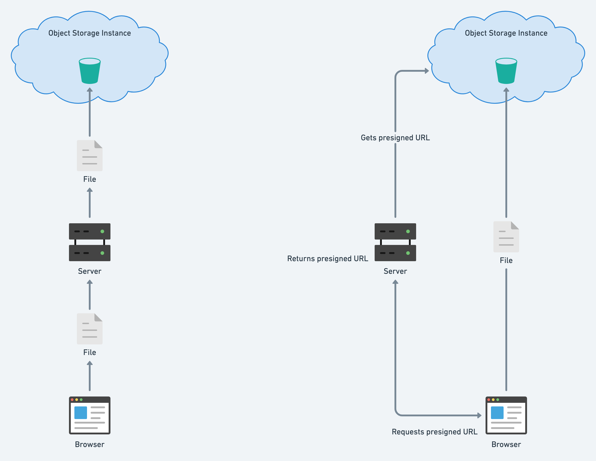
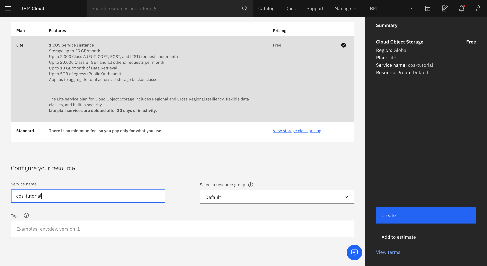
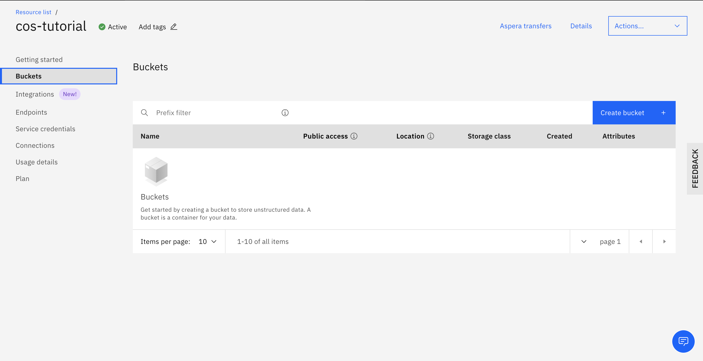
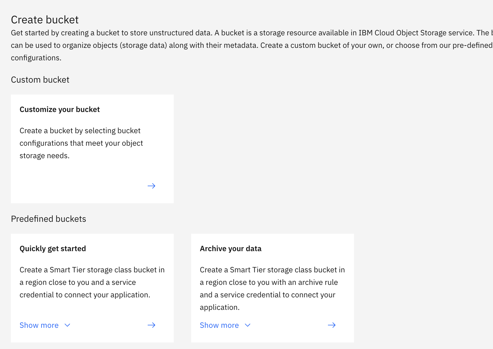
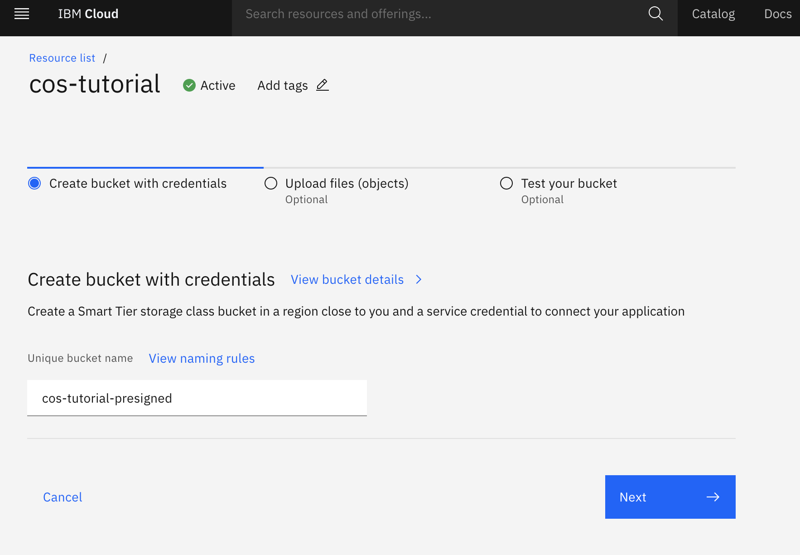
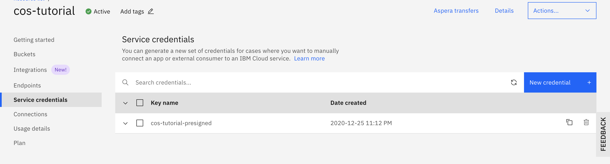
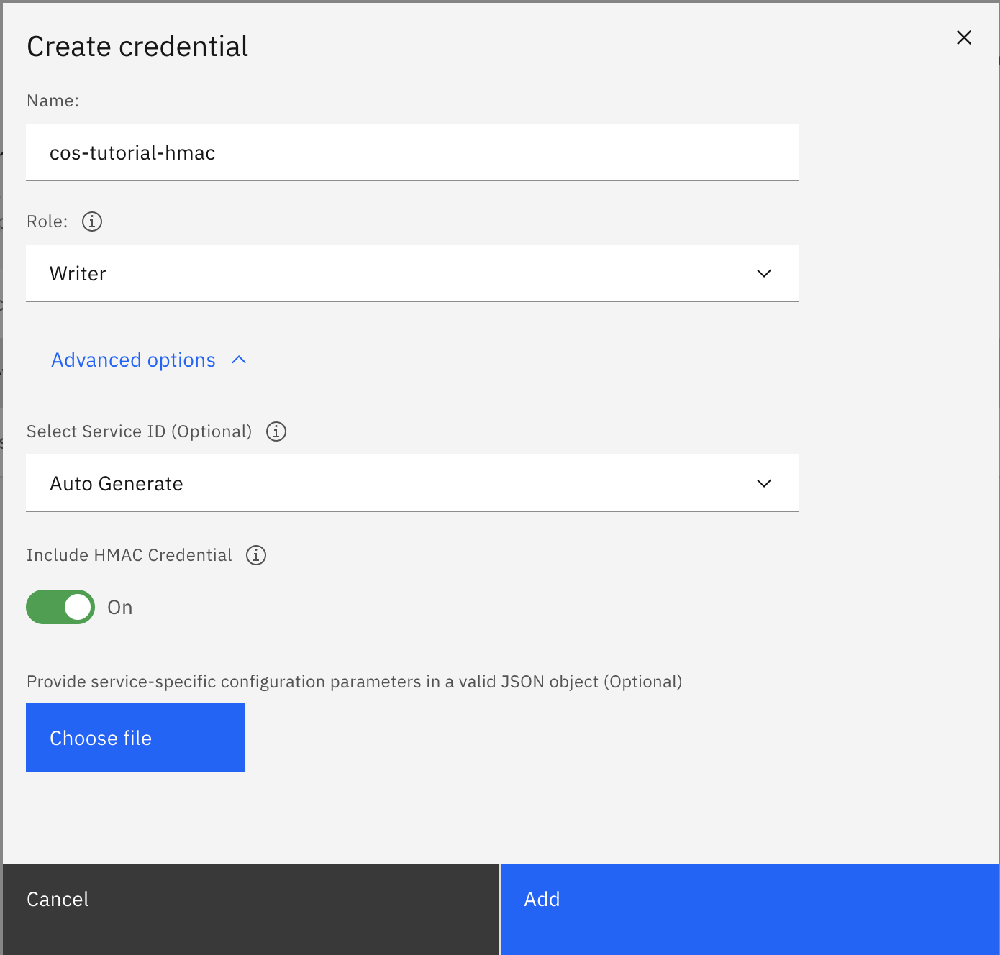
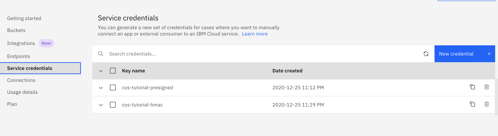
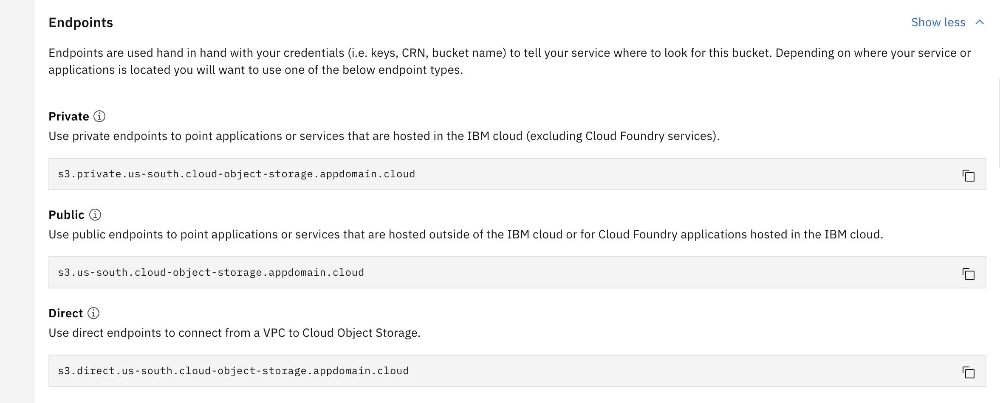

# File upload to IBM Cloud Object Storage directly from the browser. Great upload performance.

Usually, applications that do file upload will send it through a server before uploading it to a storage service. 
The problem with this approach is that may you end up with a bottleneck that causes a performance issue when you have multiple clients uploading large files at the same time. 
You can boost up the performance if the client side could upload directly to the storage service.
To achieve this you can use [*IBM Cloud Object Storage*(COS)](https://cloud.ibm.com/docs/cloud-object-storage) service. It uses a subset of the [S3 API](https://cloud.ibm.com/docs/cloud-object-storage/api-reference?topic=cloud-object-storage-compatibility-api), which includes the [**presigned URL**](https://cloud.ibm.com/docs/cloud-object-storage?topic=cloud-object-storage-presign-url) feature. A presigned URL is a temporary link generated from your COS credentials that you can send to clients so they can do operations to specific objects without authentication. The client can use the URL retrieved from the server to upload/download files directly to/from a *bucket* at your COS instance.

The following image shows a simple architecture drawing, the one in the left is what is usually done and the one in the right is what we are going to build:



In this tutorial you will: 
- Setup a COS instance to store your files. 
- Build a [**Node.js API**](https://cloud.ibm.com/docs/cloud-object-storage?topic=cloud-object-storage-node) to retrieve presigned URLs from the COS instance using your credentials.
- Build a simple front-end Javascript app to consume the API and upload files to COS using the presigned URLs.

# Prerequisites

- [Node.js and npm](https://nodejs.org/en/) installations. I'm using node 14.15.3 version and npm 6.14.9 version.
- An [IBM Cloud account](https://cloud.ibm.com/registration).
- A text editor. I'm using [VSCode](https://code.visualstudio.com/).

You can find the entire code created for the tutorial in this repo [https://github.com/gustavares/cos-tutorial/](https://github.com/gustavares/cos-tutorial/)
  
# Estimated time

TBD

# Steps

<!-- no toc -->
- [1. COS instance creation](#1-cos-instance-creation)
  - [1.1 Creating HMAC Credential](#11-creating-hmac-credential)
- [2. Node setup](#2-node-setup)
  - [2.1 COS environment variables](#21-cos-environment-variables)
    - [2.1.1 Getting the **COS_ENDPOINT** variable value](#211-getting-the-cos_endpoint-variable-value)
  - [2.2 Enabling CORS requests to our bucket](#22-enabling-cors-requests-to-our-bucket)
    - [2.2.1 Configuring the COS connection object](#221-configuring-the-cos-connection-object)
    - [2.2.2 Creating the script](#222-creating-the-script)
- [3. Express API setup](#3-express-api-setup)
  - [3.1 getPresignedUrl function](#31-getpresignedurl-function)
  - [3.2 Routes](#32-routes)
    - [3.2.1 /upload](#321-upload)
    - [3.2.2 /download](#322-download)
- [References](#references)
        

## 1. COS instance creation

Once logged into your IBM Cloud account, type *"Object Storage"* in the search bar at the top and select the Object Storage item or follow this link: [https://cloud.ibm.com/objectstorage/create](https://cloud.ibm.com/objectstorage/create). 

While at the creation screen, leave the "Lite" plan selected, scroll down to give your instance a name, and then click on the "Create" button on the right.



When inside your COS instance, click on the "Buckets" item in the left, then in the "Create bucket +" button to the right.



Now, on the create bucket screen select the "Quickly get started" option clicking in the arrow pointing right.



Leave the "Create bucket with credentials" option selected, give your bucket a name and click "Next" two times, scroll all the way down and click on the "View bucket configuration" button.



### 1.1 Creating HMAC Credential

To be able to use presigned URLs we need an [HMAC credential](https://cloud.ibm.com/docs/cloud-object-storage?topic=cloud-object-storage-uhc-hmac-credentials-main).

Click on the "Service credentials" item to the left, then on the "New credential +" button to the right.



Then on the "Create credential" modal, name your credential, click on the "Advance options" button, turn on the "Include HMAC Credential" option, and then click on the "Add" button.



Later we are coming back here to copy the contents of the created credential and paste it in our `.env` file.

## 2. Node setup

Create a folder for your server and then create a package.json using `npm init`. I'm using the `esm --yes` option so we can use `import/export` syntax:

```
$ mkdir server && cd server
$ npm init esm --yes
```
After running these commands you should have the following files inside your `server` folder:

```
server
|
└── index.js
└── main.js
└── package.json
└── package-lock.json
```

Then create the three extra files that we are going to need later: `routes.js`, `cos.js`, and `.env`:

```
server
|
└── index.js  // requires ESM modules and calls 'main.js'
└── main.js   // app start and express config
└── package.json
└── package-lock.json
└── routes.js // holds our API routes
└── cos.js    // handles everything related to COS
└── .env      // holds our environment variables
```
### 2.1 COS environment variables

Open the `.env` file and create the following variables and copy the correspondent values from the HMAC credential created earlier.

```
COS_ENDPOINT=<endpoint> // check the next section to get this value
COS_APIKEYID=<api-key>
COS_IBM_AUTH_ENDPOINT=https://iam.cloud.ibm.com/identity/token
COS_RESOURCE_INSTANCE_ID=<resource-instance-id>
COS_HMAC_ACCESS_KEY_ID=<access_key_id>
COS_HMAC_SECRET_ACCESS_KEY=<secret_access_key>
```

You can find these values in your COS instance on IBM Cloud, clicking on the "Service credentials" item on the left.



*NOTE: This might be obvious but never expose your credentials! Don't forget to add the .env file to .gitignore.*

#### 2.1.1 Getting the **COS_ENDPOINT** variable value

- Back in your COS instance, click in the **"Buckets"** item on the left, then click in the bucket we created earlier.
- On the left again, click in the **"Configuration"** item and scroll down to find the **"Endpoints"** section.
- Copy the **"Public"** url to your clipboard.
  
- Back in your text editor, in the `.env` file, paste the endpoint value for the `COS_ENDPOINT` variable.

Now we are going to install the dependencies: 

- [Express](https://expressjs.com/) - to create the API
- [IBM COS SDK for Node.js](https://www.npmjs.com/package/ibm-cos-sdk) - to easily connect to our COS instance
- [dotenv](https://www.npmjs.com/package/dotenv) - to read environment variables from `.env` file
- [Nodemon](https://www.npmjs.com/package/nodemon) - to help in development, automatically restarts the node app when file changes.
  
```
$ npm i -S express ibm-cos-sdk dotenv && npm i -S -D nodemon
```
Then add the following line to the `scripts` section of your `package.json` file:

```json
"dev": "nodemon index.js"
```

Your `package.json` file should look something like this:

```json
{
  "name": "server",
  "version": "1.0.0",
  "description": "",
  "main": "index.js",
  "module": "main.js",
  "scripts": {
    "dev": "nodemon index.js",
    "test": "echo \"Error: no test specified\" && exit 1"
  },
  "keywords": [],
  "author": "",
  "license": "ISC",
  "dependencies": {
    "dotenv": "^8.2.0",
    "esm": "^3.2.25",
    "express": "^4.17.1",
    "ibm-cos-sdk": "^1.9.0"
  },
  "devDependencies": {
    "nodemon": "^2.0.6"
  }
}
```

### 2.2 Enabling CORS requests to our bucket

In order to use the presigned URL feature, first we need to enable CORS requests to our bucket. To do this we will write a simple script that will send a CORS configuration object to our bucket using the `ibm-cos-sdk`.

#### 2.2.1 Configuring the COS connection object

- Open the `cos.js` file and import `S3` and `Credentials` classes from the `ibm-cos-sdk` and the `dotenv` module.
- Instantiate and export an object called `cos` that receveis an instance of the `S3` class, passing a config object to the constructor like below.
  
This file will also holds the functions to get the presigned URLs and will be used by our API.
```javascript
// cos.js
import { S3, Credentials } from 'ibm-cos-sdk';
import dotenv from 'dotenv';

dotenv.config();

export const cos = new S3({
    endpoint: process.env.COS_ENDPOINT,
    apiKeyId: process.env.COS_APIKEYID,
    ibmAuthEndpoint: process.env.COS_IBM_AUTH_ENDPOINT,
    serviceInstanceId: process.env.COS_RESOURCE_INSTANCE_ID,
    credentials: new Credentials(
        process.env.COS_HMAC_ACCESS_KEY_ID, 
        process.env.COS_HMAC_SECRET_ACCESS_KEY,
        null
    ),
    signatureVersion: 'v4'
});
```

#### 2.2.2 Creating the script

- Create a file called `bucketCorsConfig.js` under the `server` folder.
- Import the `cos` object from the `cos.js` module.
- Create the `enableCorsRequests` async function, copy the implementation from below. This function sends a configuration object that enables `PUT` requests from any origins to the provided bucket. [Here](https://cloud.ibm.com/docs/cloud-object-storage-cli-plugin?topic=cloud-object-storage-cli-plugin-ic-cos-cli#ic-set-bucket-cors) you can read about the `putBucketBucketCors` method we used.
- Lastly, at the end of the file call the created method passing your bucket name, mine is `cos-tutorial-presigned`.
  
```javascript
// bucketCorsConfig.js
import { cos } from './cos';

async function enableCorsRequests(bucketName) {
    try {
        const data = await cos.putBucketCors({
            Bucket: bucketName,
            CORSConfiguration: {
                CORSRules: [
                    {
                        'AllowedMethods': ['PUT'],
                        'AllowedOrigins': ['*'],
                        'AllowedHeaders': ['*']
                    }
                ],
            }
        }).promise();
    } catch(e) {
        console.error(`[OBJECT STORAGE] ERROR: ${e.code} - ${e.message}\n`);
        return false;
    }

    console.log(`[OBJECT STORAGE] Configured CORS for ${bucketName}`);
    return true;
}

enableCorsRequests('cos-tutorial-presigned');
```

Now you can open your terminal and navigate to your `server` directory and run the script with the following command:
```
$ node -r esm bucketCorsConfig.js
```

If everything was alright you will see the following message in the console:
```
[OBJECT STORAGE] Configured CORS for [name of your bucket]
```

## 3. Express API setup

Finally, let's start writing our API! In the `main.js` file, we are going to import `express` and setup our server to listen on port `3030`. We are also adding a `/health` route just for health check.

```javascript
// ESM syntax is supported.
import express from 'express';

const PORT = 3030;

const app = express();

app.use('/health', (req, res) => res.json('API is up and running!'));

app.listen(PORT, () => {
    console.log(`API listening on port ${PORT}`);
});
```

After saving your file, you can open up a terminal and navigate to your `server` directory and type: 

```
$ npm run dev
```

If everything is right, you will see the text `API listening on port 3030` on your console, and everytime you save a file you will see that the server restarts.

*NOTE: This is a configuration intended only for the purposes of this tutorial and should not be used in production. Please follow the best practices described in the Express website cited below if you intend to deploy it to a production environment.*

**Express Production Best Practices**

Security - [https://expressjs.com/en/advanced/best-practice-security.html](https://expressjs.com/en/advanced/best-practice-security.html)

Performance and Reliability - [https://expressjs.com/en/advanced/best-practice-performance.html](https://expressjs.com/en/advanced/best-practice-performance.html)
    
### 3.1 getPresignedUrl function

First we are going to create the function responsible to fetch the URLs from COS. 
- In the `cos.js` file create and export an async function called `getPresignedUrl` that receives `bucket`, `fileName`, and `operation` as parameters. Check the implementation below:

```javascript
// cos.js

import { S3, Credentials } from 'ibm-cos-sdk';
import dotenv from 'dotenv';

dotenv.config();

export const cos = new S3({
    endpoint: process.env.COS_ENDPOINT,
    apiKeyId: process.env.COS_APIKEYID,
    ibmAuthEndpoint: process.env.COS_IBM_AUTH_ENDPOINT,
    serviceInstanceId: process.env.COS_RESOURCE_INSTANCE_ID,
    credentials: new Credentials(
        process.env.COS_HMAC_ACCESS_KEY_ID, 
        process.env.COS_HMAC_SECRET_ACCESS_KEY,
        null
    ),
    signatureVersion: 'v4'
});

export async function getPresignedUrl(bucket, fileName, operation) {
    const url = await cos.getSignedUrl(operation, {
        Bucket: bucket,
        Key: fileName,
    });

    return url;
}
```

From the `cos` object, we are calling the `getSignedUrl` method from the `ibm-cos-sdk`, passing the operation we want the URL to be able to do and an options object with the bucket and file names. To upload a file we are going to pass `putObject` as the operation, if we want to download a file we are going to pass `getObject`.

You can also pass an `Expires` option to determine how long the URL will live, if no value is passed it defaults to 900 seconds(15 minutes). Read more about the `getSignedUrl` method: [https://ibm.github.io/ibm-cos-sdk-js/AWS/S3.html#getSignedUrl-property](https://ibm.github.io/ibm-cos-sdk-js/AWS/S3.html#getSignedUrl-property)

### 3.2 Routes

We are going to create two routes: `/api/presigned/upload` and `/api/presigned/download`. Both will use pretty much the same code, the only difference is the operation value. So we will have two middlewares to set those values but just a single `controller` function.

#### 3.2.1 /upload

```javascript
// routes.js
import { Router } from 'express';
import { getPresignedUrl } from './cos';

const router = Router();

router.use('/upload', async (req, res, next) => {  
    res.locals.operation = 'putObject';
    
    next();
}, controller);

async function controller(req, res, next) {
    const { bucket, fileName } = req.query;
    const { operation } = res.locals;

    try {
        const url = await getPresignedUrl(bucket, fileName, operation);

        return res.status(200).json({ url });
    } catch(e) {
        next(e);
    }
}

export const presignedRoutes = router;
```

We import the `Router` class from `expresss` and the function `getPresignedUrl` from the `cos.js` file. First we are call the `.use` method from the `router` object to create the `/upload` route. The first middleware is an `async` function that we are using just to set the operation value to be used in the next middlware, which is the `controller` function that is also going to be used by the `/download` route. 

In the `controller` function we get the `bucket` and `fileName` from the `req.query` parameters and the `operation` value from the `res.locals` object. Then we wrap the `getPresignedUrl` function in a `try/catch` block, if an error is caught we send it to the next middlware otherwise we return the `url` in a JSON format with a status 200. 

Lastly, at the end of the file export a variable called `presignedRoutes` that receives the `router` object, we need to use it in the express server later.

In the `cos.js` file, let's create and export an async function called `getPresignedDownloadUrl` function: 

#### 3.2.2 /download

Under the `/upload` route create the `/download` route, your `routes.js` file should look like this:

```javascript
// routes.js

import { Router } from 'express';
import { getPresignedUrl } from './cos';

const router = Router();

router.use('/upload', async (req, res, next) => {
    res.locals.operation = 'putObject';
    
    next();
}, controller);

router.use('/download', async (req, res, next) => {  
    res.locals.operation = 'getObject';
    
    next();
}, controller);

async function controller(req, res, next) {
    const { bucket, fileName } = req.query;
    const { operation } = res.locals;

    try {
        const url = await getPresignedUrl(bucket, fileName, operation);

        return res.status(200).json({ url });
    } catch(e) {
        next(e);
    }
}

export const presignedRoutes = router;
```

To finish up, in the `main.js` file import the `presignedRoutes` from `routes.js` and use it as a middleware like below:

```javascript
// main.js
import express from 'express';
import { presignedRoutes } from './routes';

const PORT = 3030;

const app = express();

app.use('/health', (req, res) => res.json('API is up and running!'));

app.use('/api/presigned', presignedRoutes);

app.listen(PORT, () => {
    console.log(`API listening on port ${PORT}`);
});
```

That's it for the API, you can test it using something like [Postman](https://www.postman.com/) or [Insomnia](https://insomnia.rest/).

# References

Creating a presigned URL - [https://cloud.ibm.com/docs/cloud-object-storage?topic=cloud-object-storage-presign-url](https://cloud.ibm.com/docs/cloud-object-storage?topic=cloud-object-storage-presign-url)

COS Compatibility S3 API - [https://cloud.ibm.com/apidocs/cos/cos-compatibility](https://cloud.ibm.com/apidocs/cos/cos-compatibility)

Using Node.js - [https://cloud.ibm.com/docs/cloud-object-storage?topic=cloud-object-storage-node](https://cloud.ibm.com/docs/cloud-object-storage?topic=cloud-object-storage-node)